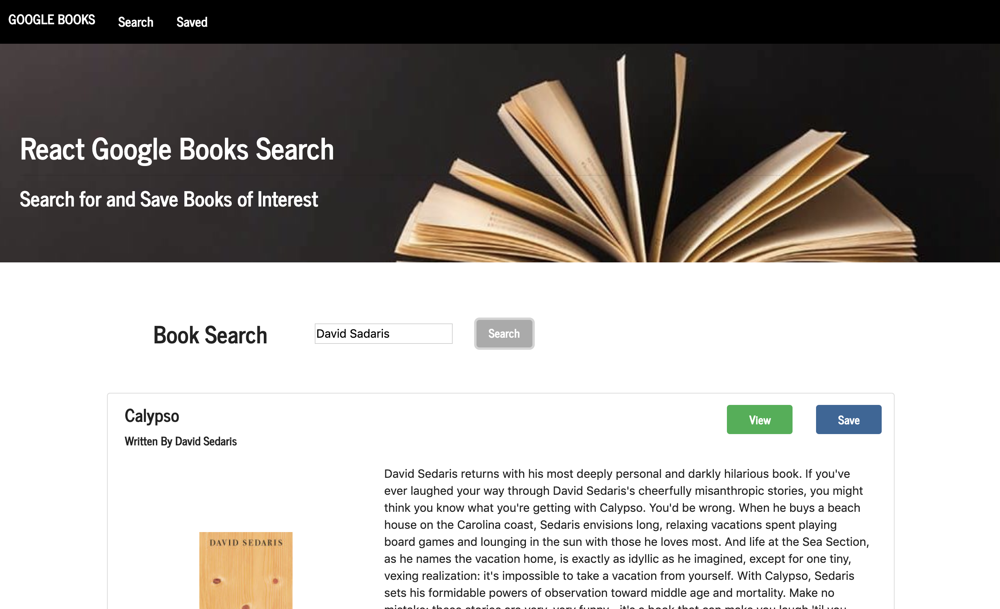

# BookSearch
an app to search and save books

## Installation

Clone folder onto your own computer by forking the repository and using the "Clone or download" button on github.

Install all npm modules using the command "npm install".

Open up your MongoDB connection. 

Run the server by calling "npm start" from the root folder. 

## Functionality
This app allows users to search for a book using Google's book search api. After seraching by inputing a search term into the form, the page will be populated with the top ten most relevant matching books. Users have the option to view the book's information by clicking the "view" button which directs them to the book's reference link. Or they can save books to view later by clicking the "save" button. Upon saving a book, the user will be redirected to the save book page where a list of all saved books appears. 

On this page, users can, again, click to view the books information or can delete the book from their saved books list by clicking the "delete" button. 

User's can navigate between the two pages using the navbar at the top of the page. 

## Coding

This website is a MERN full-stack web app. 

1. MongoDB is used to store saved book data. Mongoose is utitlized as an ORM to handle the transactions between the database and the api calls to the app's server. 

2. Node.js is used to set up the app and manage different npm packages including mongoose, express, axios, and more. 

3. The server is set up with express.js. 

4. React.js is used to create the front-end of the code. A global store is set up to hold the saved books state.

## Future Development 

If given the time, I would like to allow the users to scroll through more than 10 results from their initial search. Likewise, I would like to set the saved books page to paginate with a max of 10 books per page. 

I would like to provide an popup to inform users when they save a book and give them the option to stay on the current search page or go see the saved books. 

I would like to ensure that when a book is added to the saved list that it is not already on the list. 

## Meta 

Jamie Kook - kookjc6@gmail.com

Github Repo: 
[https://github.com/JamieKook/BookSearch](https://github.com/JamieKook/BookSearch)

Deployed App: 
[https://lychee-custard-12648.herokuapp.com](https://lychee-custard-12648.herokuapp.com)

